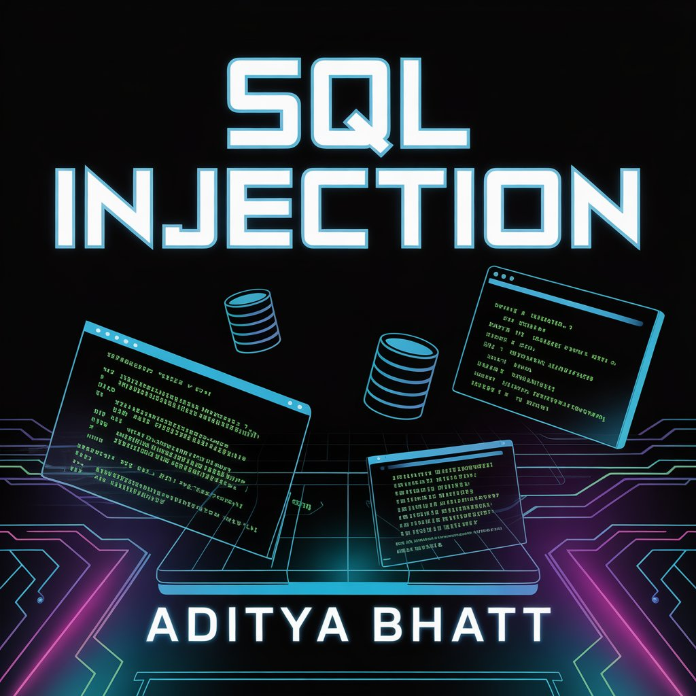
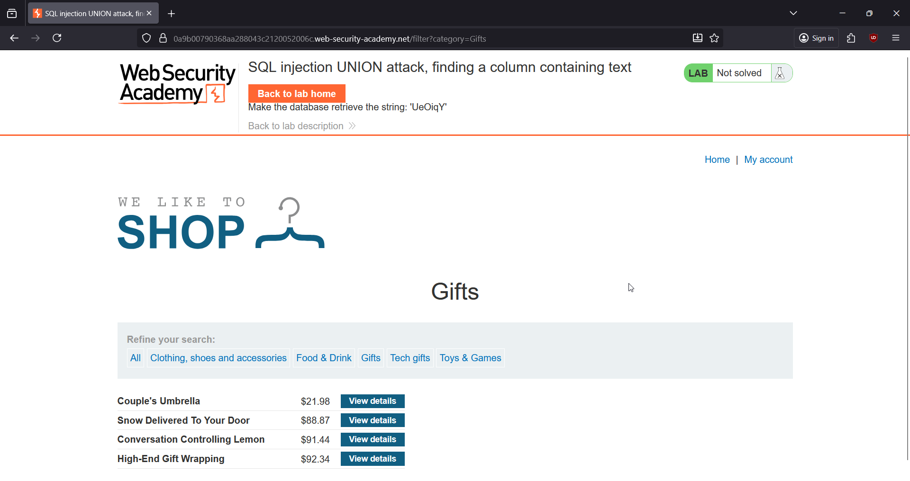
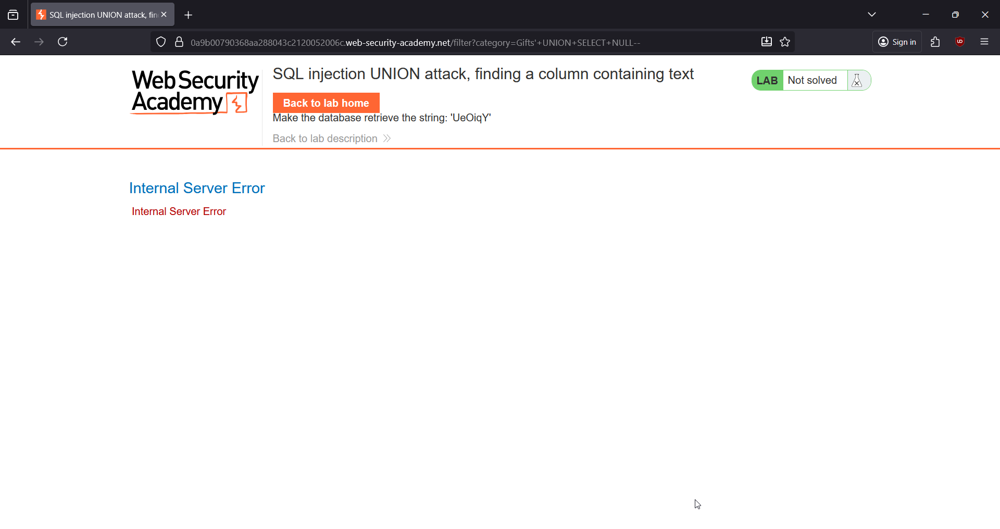
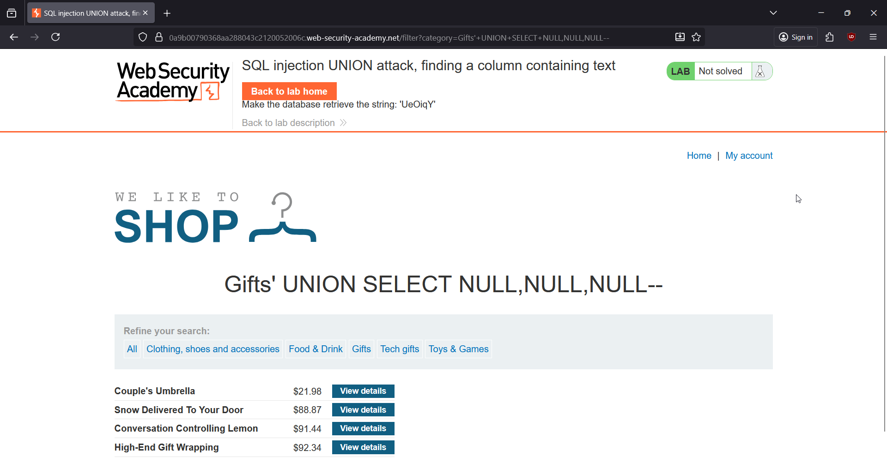
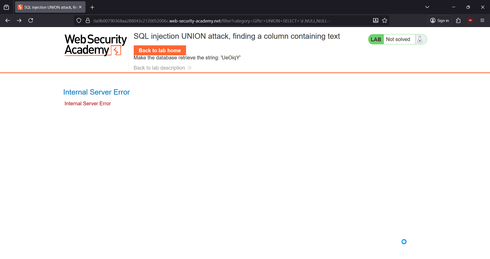
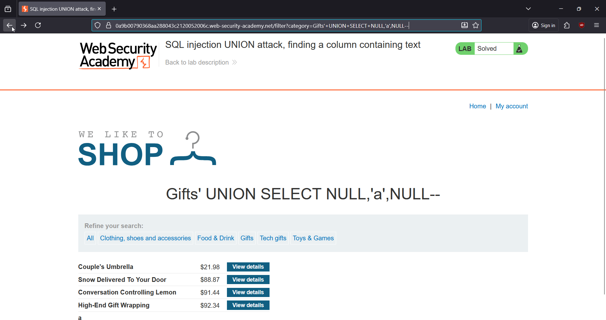
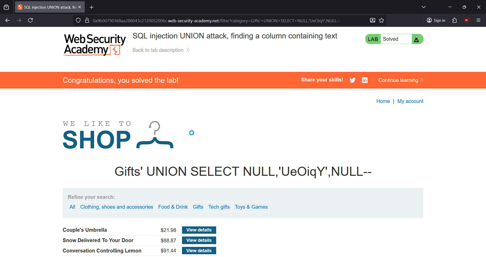

# 🎯 SQL Injection: Finding a Column That Accepts String Data

**Write-Up by Aditya Bhatt | UNION-Based SQLi | Text-Compatible Column Discovery | BurpSuite**

Once you've identified the correct number of columns for a UNION-based SQLi attack, the *next mission* is to figure out **which column accepts string data**. PortSwigger’s lab gives us a random string, and our job is to make that string appear on the page by injecting it into the right column.



---

# 🧪 TL;DR

* Backend query returns **3 columns**.
* Inject string `'abc'` or your lab’s random token into each column one by one.
* Columns that don’t accept text → **500 error**.
* When the page renders normally → **that column supports strings**.
* Inject the lab-provided token → **Lab Solved**.

---

# 🌐 Brief Intro

UNION attacks require **matching both column count and data type**.
Once you know the number of columns (3 in this lab), the next step is to identify which one can store **string values**.

We do this by replacing each `NULL` with `'a'` one at a time.
Error? → Not string compatible.
Works? → That’s the column you need.

This lab becomes trivial once you follow the systematic approach.

---

# 🧬 Step-By-Step PoC (Screenshots Included)

---

## **1. Open the Lab and Select a Category (e.g., Gifts)**

Captured the request in Burp by choosing the **Gifts** category.



➤ *Why?*
We need a baseline request to determine where to inject our payload in the `category` parameter.

---

## **2. Test UNION with 1 NULL**

Payload used:

```
+UNION+SELECT+NULL--
```

This throws an error.



➤ *Why?*
The original query has more than 1 column, so the UNION fails.

---

## **3. Test UNION with 2 NULLs**

Payload:

```
+UNION+SELECT+NULL,NULL--
```

Still an error.


➤ *Why?*
The backend query returns more than 2 columns.

---

## **4. Test UNION with 3 NULLs → Success**

Working payload:

```
+UNION+SELECT+NULL,NULL,NULL--
```

The page responds successfully and you see:

Gifts' UNION SELECT NULL,NULL,NULL--



➤ *Why?*
Three columns match the application’s SELECT statement.
We now proceed to test **data types**.

---

## **5. Test If Column 1 Accepts Text**

Payload:

```
+UNION+SELECT+'a',NULL,NULL--
```

This gives a 500 error.



➤ *Why?*
Column 1 does **not** support string data.

---

## **6. Test If Column 2 Accepts Text**

Payload:

```
+UNION+SELECT+NULL,'a',NULL--
```

The page renders cleanly.



➤ *Why?*
Column 2 **does** accept string data.
This is where we place the lab’s random string.

---

## **7. Inject the Lab’s Provided String (e.g., UeOiqY)**

Final payload:

```
+UNION+SELECT+NULL,'UeOiqY',NULL--
```

You now see the string appear directly in the page output → **Lab Solved**.



➤ *Why?*
We successfully found a string-compatible column and inserted the required value.

---

# 🎉 Lab SOLVED

We identified both:

* **Column count:** 3
* **String-compatible column:** Column 2

And successfully injected the lab’s value (`UeOiqY`) to complete the challenge.

---

# 🧠 Key Takeaways

* After discovering column count, **test data types one-by-one**.
* A `500 Internal Server Error` almost always indicates **data type mismatch**.
* The column that renders successfully with `'a'` is your target.
* This technique is mandatory for later labs involving:

  * extracting usernames
  * dumping tables
  * enumerating DB metadata

---

# 👋 Final Thoughts

String-column discovery is one of the most important early SQLi enumeration techniques. Once you master it, you can chain this with other UNION-based payloads to extract deep application data.

Till then,
Stay curious, stay sharp.
— **Aditya Bhatt** 🔥

---
